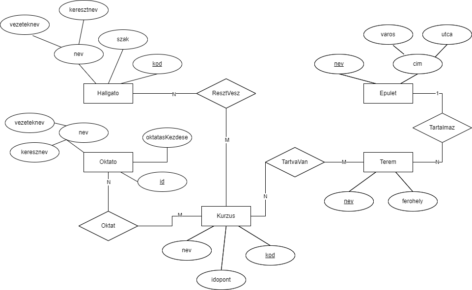

# NotNeptun Dokumentáció
## Előszó
A program Apache XAMP-ot használ, mysql adatbázissal, nimble programozási nyelvben irva. Elméletileg teljesen cross platform (Windows, Linux, macOS), viszont csakis Windows-on volt tesztelve.
## Inditás
Inditás lehetséges egyenesen a NotNeptun mappájában lévő exe fájlal, de ha valamiért nem működne akkor szükségünk lesz a nimble-re: https://nim-lang.org/install.html.

Forditani és inditani egyszerre a `nim c -r ./NotNeptun.nim -d:release --threads:on` paranccsal lehet. Utána pedig a létrehozott bináris fájlal.

## Egyed-Kapcsolati Diagram

## Relációs sémák
Hallgato(<u>kód</u>, vezeteknev, keresztnev, szak)  
Oktato(<u>kód</u>, vezeteknev, keresztnev, kezdes)
Kurzus(<u>nev</u>, idopont, kod)  
Terem(<u>epuletnev</u>, <u>nev</u>, ferohely)  
Epulet(<u>nev</u>, varos, utca)  

ResztVesz(<u>Hallgato.kod</u>, <u>Kurzus.kod</u>)  
Oktat(<u>Oktato.id</u>, <u>Kurzus.kod</u>)  
TartvaVan(<u>Kurzus.kod</u>, <u>Terem.epuletnev</u>)  

## 2CNF

## 3CNF
